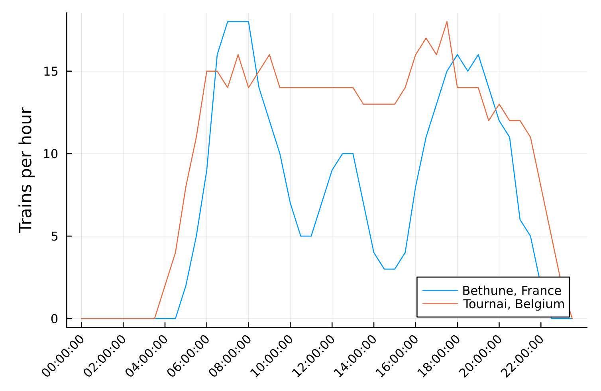

# grabbing french train times

OEBB scotty:
https://fahrplan.oebb.at/webapp

abfahrten -> station you want, time you want

copy all times and paste into vim


magic vim command to delete all lines that aren't departures:

```
%g!/^[0-9]\{2}:[0-9]\{2}$/d
```

done

# piccie


